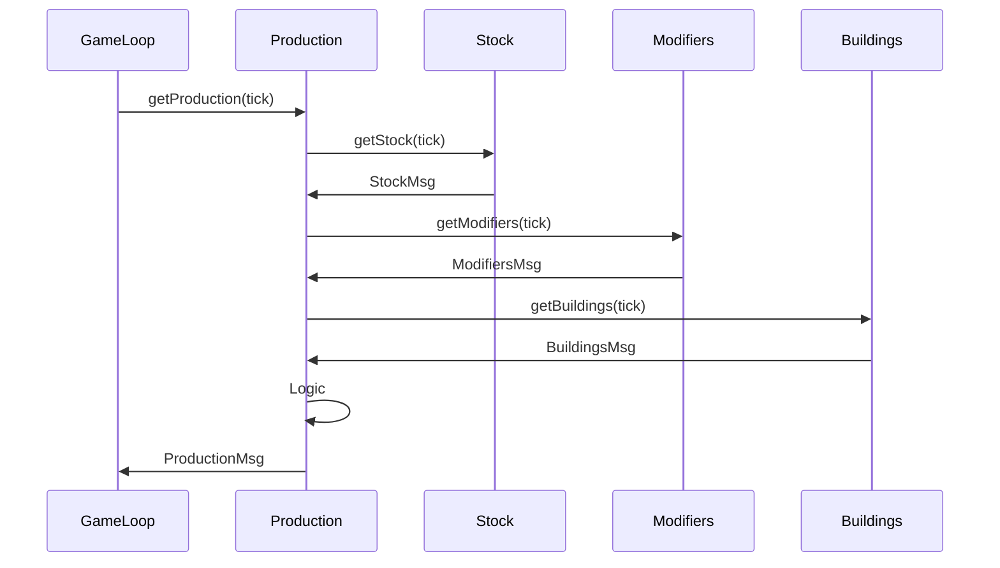
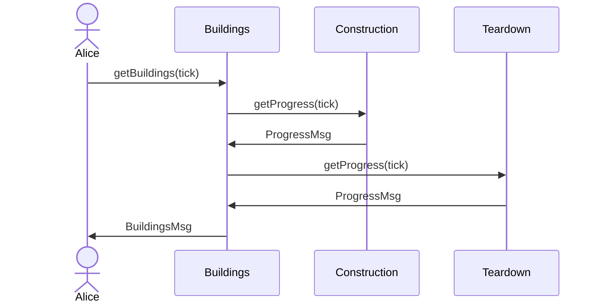

- Resource **Production** depends on
  - Resource *stock*
  - Workforce (population)
    - TODO is it another *resource*?
  - Available energy (another *resource*)
  - Game modifiers
  - Player modifiers
  - Planet modifiers
    - Sol modifiers
    - Gal modifiers
  - Available buildings

- Construction **Progress** depends on
  - Item specific construction time
  - Delayed by
    - Energy shortage
    - Workforce motivation
  - Modifiers

