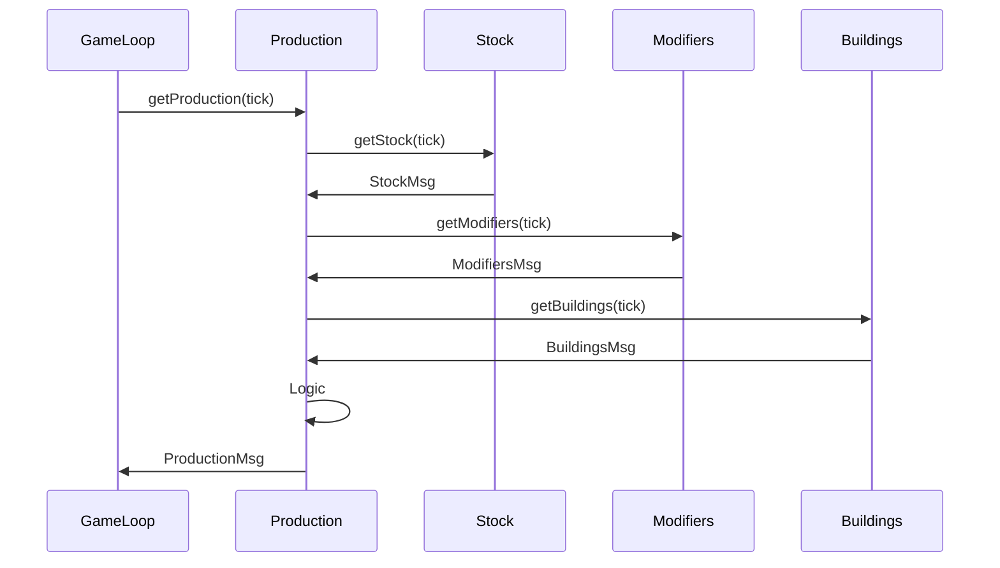
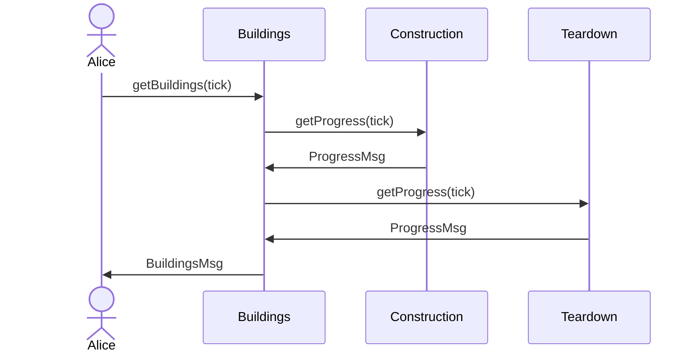

Game loop
=========

Use game loop with phases to separate concerns.

1. Input Processing

    Example:
    - Players submit fleet movement orders, which take effect at the start of the tick.
    - Players submit building construction orders, which take effect at the start of the tick.

2. Resource Updates

    - Calculate income and subtract maintenance costs.
    - Apply effects like energy shortages or bonuses.

    Example: Mines produce resources, power plants consume fuel, research progresses.

3. Building and Unit Production

    - Check for completed buildings, units, and tech.
    - Trigger construction completion events.

   Start any queued constructions that should begin this tick.

4. Movement and Position Updates

    - Move ships, convoys, or units.
    - Update positions based on velocity, current paths, or warp mechanics.
   
   Resolve arrival events.

5. Conflict Resolution

   - Handle combat (space battles, ground combat).
   - Compute outcomes based on engagement rules.
   - Apply damage, destruction, or retreat mechanics.

6. Player Visibility & Sensor Updates

   - Update fog of war and detected objects.
   - Notify players of newly detected threats, anomalies, or fleets.

7. Cleanup & Persistence

   - Remove dead objects (destroyed ships, depleted resources).
   - Update player logs, database state, and notifications.
   - Store only the changes since the last tick.

Considerations When Ordering Phases

- Resource updates first ensures all phases have correct values.
- Building completion before combat allows finished defenses to help.
- Movement before combat ensures battles happen at the correct location.
- Combat before persistence cleanup ensures destroyed units/buildings don’t interfere.

Other
-----

- Resource **Production** depends on
  - Resource *stock*
  - Workforce (population)
    - TODO is it another *resource*?
  - Available energy (another *resource*)
  - Game modifiers
  - Player modifiers
  - Planet modifiers
    - Sol modifiers
    - Gal modifiers
  - Available buildings

- Construction **Progress** depends on
  - Item specific construction time
  - Delayed by
    - Energy shortage
    - Workforce motivation
  - Modifiers

